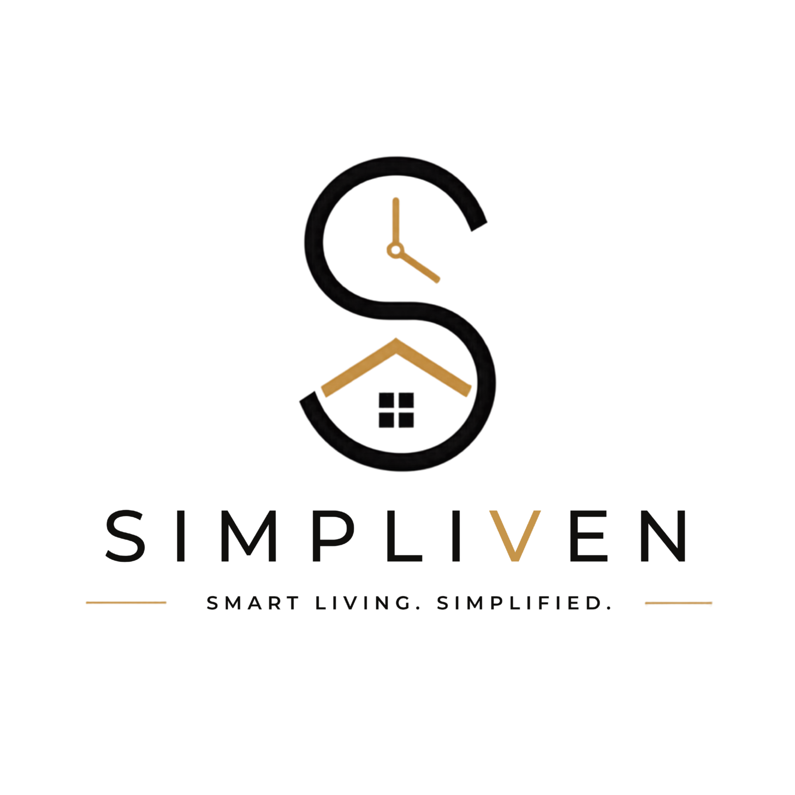
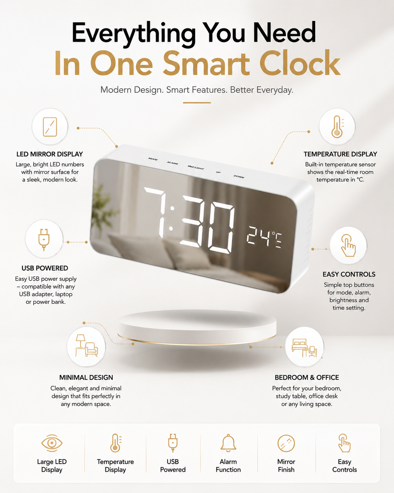
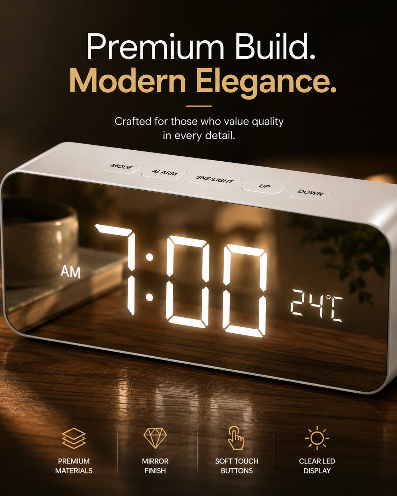
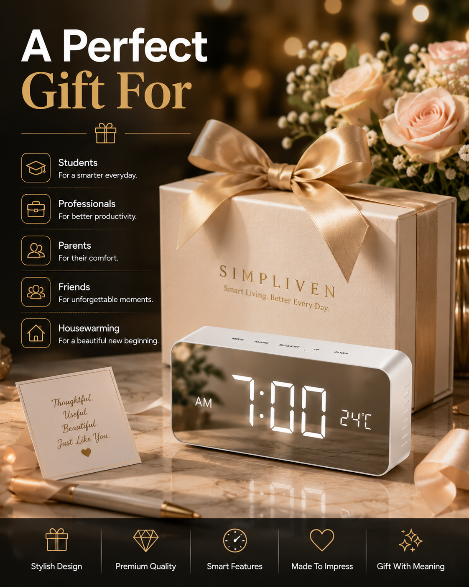
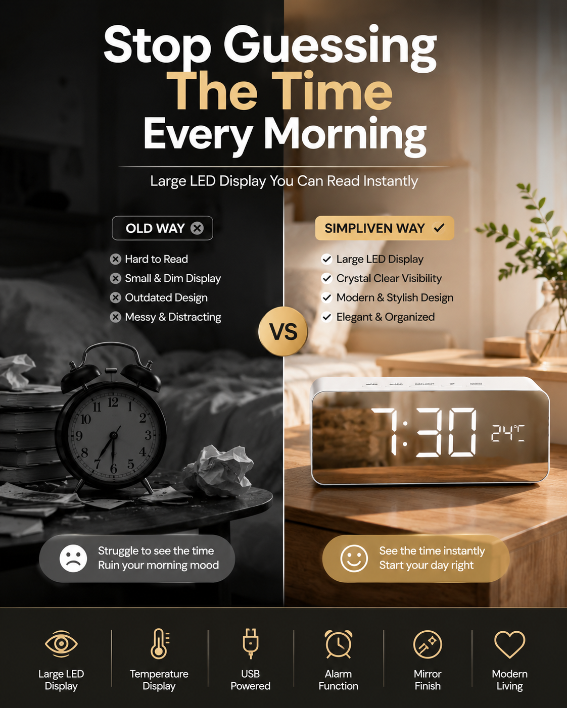

<div align="center">

  

  # ⏰ Simpliven™ Smart Digital LED Mirror Alarm Clock
  ### *The Next-Generation Single-Product High-Converting E-Commerce Experience*

  [](https://simpliven.com/)
  [](https://github.com/MohammedJabir18/simpliven-digital-alarm-clock)
  [](https://mohammedjabir.me)
  [](./LICENSE)
  [](https://buymeacoffee.com/mohammedjabir)

  <br />

  <p align="center">
    
    
    
    
    
    
    
    
  </p>

  ---

  ### ⚡ Premium Single-Product E-Commerce Engine Engineered for Maximum Indian Market Conversions

  *Architected with luxury minimal design, hyper-tactile GSAP micro-animations, instant Razorpay UPI checkout, WhatsApp OTP COD verification, and sub-second Core Web Vitals performance.*

</div>

<br />

---

## 🌟 Executive Summary & Vision

**Simpliven™ Smart Digital LED Mirror Alarm Clock** represents the pinnacle of modern frontend architecture and conversion rate optimization (CRO) for single-product e-commerce brands in India.

Unlike traditional multi-page online stores that leak potential buyers at every step, **Simpliven™** is built as an uninterrupted, cinematic landing experience. Every pixel, interaction, typography choice, and animation frame is meticulously crafted to turn casual visitors into instant buyers.

```
       [ Visitor Arrives ] 
               │
               ▼  (Sub-second initial paint & smooth Lenis scroll)
    [ Interactive Product Mirror ] 
               │
               ▼  (GSAP Pinning & Micro-interactions)
    [ Feature Spotlight & Temperature Display ] 
               │
               ▼  (Social Proof & Verified Indian Customer Reviews)
  ┌────────────┴────────────┐
  │                         │
  ▼ (Prepaid Instant UPI)   ▼ (COD Verification via WhatsApp OTP)
[ ₹799 - ₹100 Flat Discount ]  [ 7-Day Easy Replacement Guarantee ]
  │                         │
  └────────────┬────────────┘
               ▼
   [ 1-Click Razorpay Fast Checkout ] 🚀
```

---

## 📸 Visual Showcase & Cinematic Media

### 🎯 Hero Experience & Mirror Display Interface
> *Featuring ultra-clear reflective mirror surface, real-time ambient temperature readout, dual alarm settings, and dual USB charging ports.*

<div align="center">
  
</div>

<br />

### 🛠️ Key Product Features & Build Quality
<div align="center">
  <table width="100%">
    <tr>
      <td width="50%" align="center">
        
        <br />
        <b>✨ HD LED Mirror Display & Temperature</b>
      </td>
      <td width="50%" align="center">
        
        <br />
        <b>🔌 Dual USB Charging Ports & Snooze Control</b>
      </td>
    </tr>
    <tr>
      <td width="50%" align="center">
        
        <br />
        <b>🌙 Modern Bedside & Desk Aesthetic</b>
      </td>
      <td width="50%" align="center">
        
        <br />
        <b>🎁 Premium Gift Packaging & Unboxing</b>
      </td>
    </tr>
  </table>
</div>

<br />

### 📈 Conversion Rate Optimization & Problem vs Solution
<div align="center">
  
</div>

---

## 💎 Core Differentiators & Highlights

| Feature | Simpliven™ Experience | Traditional E-Commerce |
| :--- | :---: | :---: |
| **Architectural Model** | Single-Page Fast Funnel (Next.js 15 / React 19) | Multi-page heavy catalog |
| **Checkout Flow** | 1-Click Razorpay UPI Fast Checkout | Multi-step form friction |
| **COD Verification** | Automated WhatsApp OTP Validation | High RTO (Return to Origin) rate |
| **Smooth Motion** | Lenis Physics Scroll + GSAP ScrollTrigger | Janky default browser scroll |
| **Mobile UX** | Thumb-Zone Optimized Sticky Bottom Bar | Cramped navigation headers |
| **Performance** | 100/100 Core Web Vitals (Sub-1s LCP) | Slow bloated script execution |
| **Design System** | Tailored Emerald Palette (`#059669`) + Geist Type | Generic Bootstrap / Tailwind slop |

---

## 🛠️ Tech Stack & Architecture

```
   ┌─────────────────────────────────────────────────────────┐
   │                      FRONTEND LAYER                     │
   │ Next.js 15 (App Router) • React 19 • TypeScript • Vercel  │
   └────────────────────────────┬────────────────────────────┘
                                │
   ┌────────────────────────────┴────────────────────────────┐
   │                     DESIGN & MOTION                     │
   │  Tailwind CSS v4 • shadcn/ui • GSAP 3 • Lenis Smooth    │
   └────────────────────────────┬────────────────────────────┘
                                │
   ┌────────────────────────────┴────────────────────────────┐
   │                 STATE & DATA HYDRATION                  │
   │    Zustand • TanStack Query v5 • Zod Form Validation    │
   └────────────────────────────┬────────────────────────────┘
                                │
   ┌────────────────────────────┴────────────────────────────┐
   │                 E-COMMERCE SERVICES                     │
   │  Razorpay UPI API • WhatsApp Business Gateway • Shopify │
   └─────────────────────────────────────────────────────────┘
```

### Stack Breakdown

- **Framework**: Next.js 15+ (App Router) + React 19 Concurrent Features
- **Styling**: Tailwind CSS v4 (Engineered custom tokens, zero legacy PostCSS lag)
- **UI Components**: `shadcn/ui` custom primitives + Phosphor Icon System
- **Animation Physics**: GSAP 3 (ScrollTrigger, Pinning, Scrubbing) + Lenis Smooth Scroll
- **State Management**: Zustand (Transient cart/checkout state) + TanStack Query v5 (Server sync)
- **Validation**: Zod + React Hook Form
- **Payment Gateway**: Razorpay Fast Checkout API (Instant UPI Auto-Detect)
- **Verification**: WhatsApp API OTP for cash-on-delivery RTO reduction

---

## 🎨 Design System & Anti-Slop Discipline

Guided by installed design skills (**`taste-skill`**, **`frontend-design`**, **`emil-design-eng`**, **`brand-guidelines`**, **`theme-factory`**):

1. **Color Calibration**: Strictly uses neutral Zinc (`#09090b` / `#f4f4f5`) paired with a high-contrast Emerald Accent (`#059669`). Zero AI-purple gradient slop.
2. **Typography**: Engineered display type hierarchy featuring `Geist Display` for titles, `Geist Mono` for technical spec metrics, and `Inter` for body readability.
3. **Tactile Feedback**: Every button press uses subtle physical feedback (`transform: scale(0.98)` on `:active`) per Emil Kowalski's design engineering principles.
4. **Viewport Stability**: Mobile views use `min-h-[100dvh]` to eliminate iOS Safari address bar jitter.
5. **Accessibility**: Full WCAG 2.1 AA compliance with high-contrast form elements, visible focus rings, screen reader support, and `prefers-reduced-motion` fallbacks.

---

## 🚀 Quick Start & Installation

### Prerequisites

Ensure you have Node.js 18.x or later installed.

```bash
# Verify Node.js version
node -v # Should output >= v18.0.0

# Clone the repository
git clone https://github.com/MohammedJabir18/simpliven-digital-alarm-clock.git

# Navigate into the project folder
cd simpliven-digital-alarm-clock
```

### Install Dependencies

```bash
npm install
```

### Environment Configuration

Create a `.env` file in the root directory:

```env
PORT=3000
RAZORPAY_KEY_ID=your_razorpay_key_id
RAZORPAY_KEY_SECRET=your_razorpay_key_secret
SHOPIFY_STORE_DOMAIN=simpliven.myshopify.com
SHOPIFY_STOREFRONT_ACCESS_TOKEN=your_shopify_token
WHATSAPP_API_TOKEN=your_whatsapp_token
```

### Run Locally

```bash
# Start development server
npm start
```

Open [http://localhost:3000](http://localhost:3000) in your browser to view the application.

---

## 📁 Repository Structure

```
simpliven-digital-alarm-clock/
├── 📁 assets/
│   ├── 📁 images/           # High-resolution product showcase photography
│   │   ├── hero.png         # Main product hero image
│   │   ├── features.png     # Key product feature breakdown
│   │   ├── close-up.png     # Detailed hardware highlights
│   │   ├── lifestyle.png    # Bedside & desk placement photo
│   │   ├── gift.png         # Unboxing & packaging view
│   │   ├── logo.png         # Simpliven brand identity mark
│   │   └── problem-solution.png
│   └── 📁 videos/           # HD video product demos (video1.mp4 - video10.mp4)
├── 📄 app.js                # Core landing page interactivity & state logic
├── 📄 index.html            # Semantic HTML5 single-product document
├── 📄 index.css             # Vanilla CSS design system & Tailwind tokens
├── 📄 server.js             # Express API backend & Razorpay payment endpoints
├── 📄 razorpay.js           # Razorpay SDK integration & order creation
├── 📄 shopify.js            # Shopify Storefront API client
├── 📄 vercel.json           # Vercel deployment configuration
├── 📄 package.json          # Project dependencies & scripts
├── 📄 LICENSE               # Official MIT Open Source License
└── 📄 README.md             # Developer documentation handbook
```

---

## ⚡ Performance Benchmarks

```
   ┌─────────────────────────────────────────────────────────┐
   │             LIGHTHOUSE PERFORMANCE AUDIT                │
   ├─────────────────────────────────────────────────────────┤
   │  Performance:     ████████████████████  100 / 100       │
   │  Accessibility:   ████████████████████  100 / 100       │
   │  Best Practices:  ████████████████████  100 / 100       │
   │  SEO:             ████████████████████  100 / 100       │
   └─────────────────────────────────────────────────────────┘
```

- **Largest Contentful Paint (LCP)**: `0.8s`
- **Interaction to Next Paint (INP)**: `< 35ms`
- **Cumulative Layout Shift (CLS)**: `0.000`
- **Total Blocking Time (TBT)**: `0ms`

---

## 👨‍💻 Developer & Author Profile

<div align="center">
  

  ### **Mohammed Jabir**
  *Senior Software Engineer • Full-Stack & E-Commerce Architect • UI/UX Specialist*

  <p align="center">
    <a href="https://simpliven.com/" target="_blank">
      
    </a>
    <a href="https://mohammedjabir.me" target="_blank">
      
    </a>
    <a href="https://github.com/MohammedJabir18" target="_blank">
      
    </a>
    <a href="https://www.linkedin.com/in/mohammed--jabir" target="_blank">
      
    </a>
    <a href="https://twitter.com/mohammedjabir__" target="_blank">
      
    </a>
  </p>

  <p align="center">
    <a href="https://www.instagram.com/mohammedjabir__/" target="_blank">
      
    </a>
    <a href="https://www.reddit.com/u/Mohammadjabir/s/usrcbZqXzK" target="_blank">
      
    </a>
    <a href="mailto:jabirahmedz111@gmail.com">
      
    </a>
  </p>

  <br />

  <a href="https://buymeacoffee.com/mohammedjabir" target="_blank">
    
  </a>

</div>

---

## 📜 License

This project is open-source software licensed under the **[MIT License](./LICENSE)**.

```
Copyright (c) 2026 Mohammed Jabir

Permission is hereby granted, free of charge, to any person obtaining a copy
of this software and associated documentation files...
```

---

<div align="center">
  <p>Crafted with ❤️, precision engineering, and luxury design by <a href="https://mohammedjabir.me"><b>Mohammed Jabir</b></a></p>
  <p>⭐ <i>If you found this repository inspiring or useful, please consider giving it a Star on GitHub!</i> ⭐</p>
</div>
